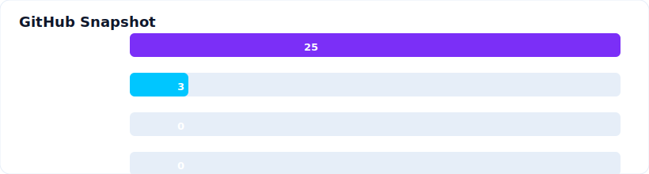
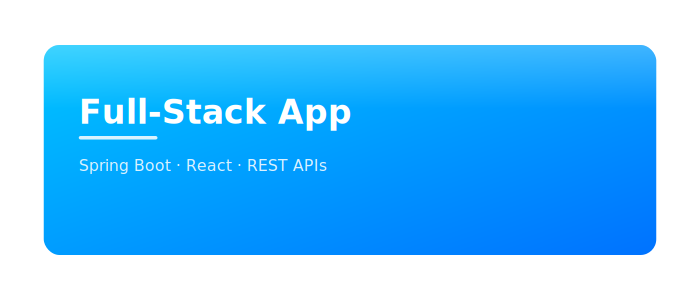

	

	<strong style="font-size:22px">Niket Mishra</strong> 
	Full Stack Developer • Technical Writer • Blogger

	I design and build production-ready web applications and clear technical documentation — combining front-end craftsmanship with back-end systems knowledge to deliver maintainable, performant solutions.

	
	
	
	
	

**What I Do:**
- Build responsive, accessible user interfaces and component libraries.
- Implement back-end services, APIs, and database-backed applications.
- Write developer-focused guides, tutorials, and documentation for teams.

**Core Skills:**
HTML · CSS · JavaScript · React · Angular · Flutter · Java · Spring Boot · Spring MVC · .NET · C# · .NET MVC · WordPress

**Databases:**
MySQL · PostgreSQL · MSSQL

**Tools & Platforms:**
Git · VS Code · Visual Studio · Firebase · Supabase · Docker · REST APIs · CI/CD · Component-driven UI · Accessibility · Responsive Design

---

## Snapshot

Embedded live GitHub stats and language summary.

**Top Languages:** JavaScript · Java · C# · HTML · CSS · SQL

> Note: Live Vercel cards were paused; this SVG renders current counts (repositories, followers, stars, forks) pulled directly from the GitHub API when generated.

---

## Featured Projects

Click any thumbnail for details.

	
	
	

(Detailed case studies and live links available on request.)

---

## Collaboration & Availability

Available for freelance work, contract roles, and collaborative projects. I enjoy working on end-to-end product builds, developer tooling, and documentation projects.

---

## Contact

- **Email:** [niketmishra436@gmail.com](mailto:niketmishra436@gmail.com)
- **Instagram:** [@Niket Mishra](https://www.instagram.com/_n.i.k.e.t_)
- **GitHub:** https://github.com/Niket-mishra

---

Built with care. Let’s build something meaningful.

© Niket Mishra

